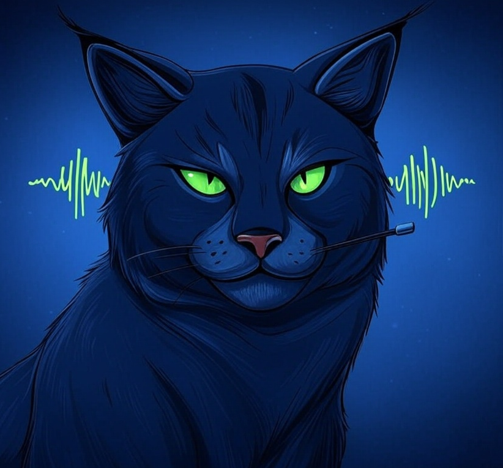

# LynxWhisper

<div style="display: flex; flex-wrap: wrap; align-items: center; gap: 20px;">
  
  <div style="flex: 1; min-width: 200px;">
  <p>
  Lynx hears you, whisper speech-to-text with a lynx’s precision.
  </p>
  <p>
  <b>LynxWhisper</b> is a soon to be cross-platform speech-to-text tool that types dictated text directly at your cursor using Whisper’s local model.
  </p>
  </div>
</div>

## Features
- [x] OpenAi Whisper model integration (Tiny by default)
- [x] Whisper model for offline transcription
- [x] Speech-to-text at cursor position
- [x] Hotkey support for manual and automatic modes
- [x] Configurable settings for hotkeys and mode
- [ ] Works on Linux (X11), macOS (WIP), Windows (WIP)


## Requirements

To build and run LynxWhisper, you’ll need the following:

### Runtime Dependencies
- **Whisper Model**: A GGML-compatible Whisper model file (e.g., `tiny.en.ggml.bin`).
  - Download from [Hugging Face](https://huggingface.co/ggerganov/whisper.cpp/tree/main) or convert your own with `whisper.cpp`.
  - Specify the path in `config.toml` (see Configuration below).
- **Microphone**: A working mic for audio input.

### Build Dependencies
- [Take a look at build.md](build.md)
- **Basics:** 
    - Get Rust, 
    - Install dependancies: `libxdo-dev` & `libasound2-dev`, 
    - Grab a model like `tiny.en.ggml.bin` from [Hugging Face](https://huggingface.co/ggerganov/whisper.cpp/tree/main).
    - Update `config.toml` with the model path (e.g. path = "path/to/tiny.en.ggml.bin").
    - get to the right place and run `cargo build --release`,

### Usage

Run LynxWhisper with:
```bash
cargo run --release
```
* Manual Mode: Press `Ctrl+Shift+>` to start recording, `Ctrl+Shift+<` to stop and type the transcription.

* Automatic Mode: Press `Ctrl+Shift+?` to toggle continuous dictation (transcribes every 5 seconds by default).

* Configuration: Edit `config.toml` to tweak hotkeys, mode, or chunk interval (see Configuration below).

Ensure your microphone is active and the Whisper model path in `config.toml` is correct.

## Configuration
Edit `config.toml` to set mode, model path, and hotkeys. See the sample file for details.

## License


## TODO and Reality
- Current state of the project is hacky working
- [x] In auto mode, stop recording when a hotkey is pressed
- [ ] add tests
- [ ] build a UI to set and test hotkeys
- [ ] build for windows or osx, currently only linux is supported
- [ ] answer the question: what about WASM target?
- [ ] Add some pre and post processing.
- [ ] Background noise handling and reduction (maybe noise cancellation :-O )


[def]: assets/lynxwhisper_img.png#center#width-200px